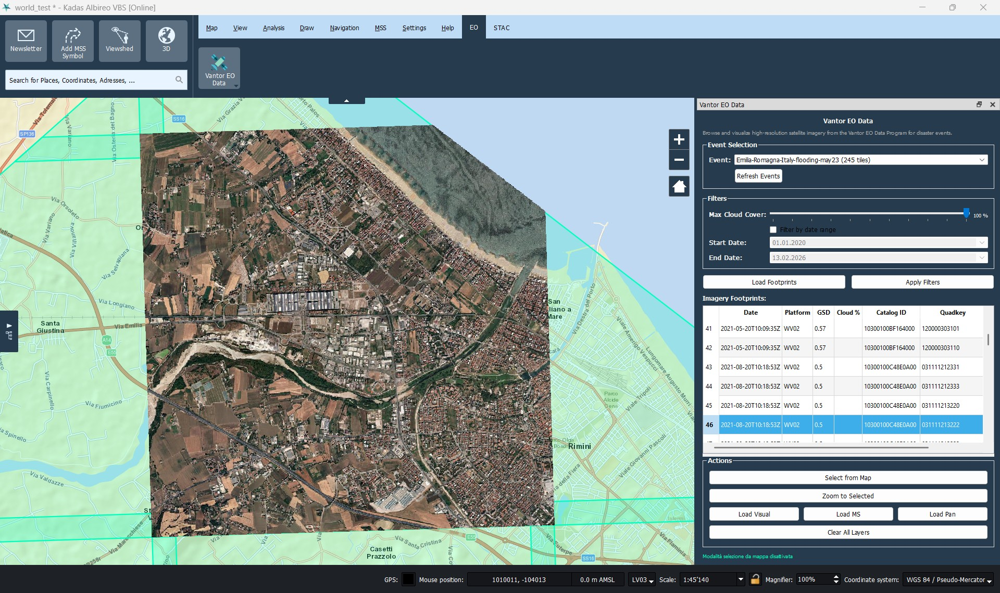

# KADAS Vantor Open Data Plugin

KADAS plugin to visualize and download high-resolution Vantor Open Data satellite imagery.

 

## Features

- **Event Browsing**: Explore natural disaster events with available Vantor satellite imagery
- **Interactive Selection**: Select footprints directly from the map with bidirectional map-table synchronization
- **Advanced Filters**: Filter by cloud cover, time range and other properties
- **COG Loading**: Load Cloud Optimized GeoTIFF imagery (visual, multispectral, panchromatic)
- **Multi-CRS Support**: Works with any coordinate reference system via PROJ
- **KADAS Integration**: Fully integrated into KADAS Albireo interface

## Key Features

### Interactive Selection
- Click on the map to select individual footprints
- Ctrl+Click for multiple selection
- Automatic synchronization between map and table
- Works even with sorted table

### Filters
- Maximum cloud cover (0-100%)
- Customizable date range
- Dynamic filter application

### Imagery Management
- Metadata visualization (date, platform, GSD, cloud cover)
- Visual imagery loading (RGB)
- Multispectral imagery loading
- Panchromatic imagery loading
- Automatic zoom to selection

## Installation

### From ZIP File
1. Download the latest release from [GitHub Releases](https://github.com/mlanini/kadas-vantor-plugin/releases)
2. In KADAS, go to `Plugins → Manage and Install Plugins → Install from ZIP`
3. Select the downloaded ZIP file
4. Restart KADAS

### From Git Repository
```bash
cd %APPDATA%/kadas-albireo2/python/plugins
git clone https://github.com/mlanini/kadas-vantor-plugin.git kadas_maxar
```

### Manual Installation
1. Copy the `kadas_maxar` folder to:
   - Windows: `%APPDATA%/kadas-albireo2/python/plugins/`
   - Linux: `~/.local/share/kadas-albireo2/python/plugins/`
   - macOS: `~/Library/Application Support/kadas-albireo2/python/plugins/`
2. Restart KADAS
3. Enable the plugin from `Plugins → Manage and Install Plugins`

## Usage

### 1. Open the Panel
- Menu: `View → Panels → Vantor Open Data`
- Or ribbon tab "EO": click on the satellite icon

### 2. Select an Event
- Use the "Event Selection" dropdown menu
- Click "Refresh Events" to update the list
- Select an event of interest

### 3. Load Footprints
- Click "Load Footprints" to load polygons on the map
- Footprints are displayed as semi-transparent blue vector layer

### 4. Filter and Select
- Set filters (cloud cover, date range)
- Click "Apply Filters" to apply
- Use "Select from Map" for interactive map selection
- Or select rows from the table

### 5. Load Imagery
- Select one or more footprints
- Click "Load Visual", "Load MS" or "Load Pan"
- Images are loaded as COG raster layers

## Requirements

- KADAS Albireo 2.x
- QGIS 3.x core libraries (included in KADAS)
- Python 3.9+ (included in KADAS)
- GDAL with COG support (included in KADAS)
- Internet connection to download data from GitHub and AWS S3

## Architecture

The plugin uses the [opengeos/maxar-open-data](https://github.com/opengeos/maxar-open-data) dataset hosted on GitHub:
- **Events**: `datasets.csv` with event names and tile counts
- **Footprints**: GeoJSON files per event (`datasets/{event}.geojson`)
- **Imagery**: Cloud Optimized GeoTIFF hosted on AWS S3
- **Network**: Uses `QgsNetworkAccessManager` to respect KADAS proxy settings
- **CRS**: Automatic transformation via PROJ for any coordinate reference system

## Development

### Test Environment Setup
```powershell
# Windows
cd kadas_maxar
python -m pytest

# With coverage
python -m pytest --cov=kadas_maxar
```

### Creating Distribution Package

```powershell
# Creates kadas-vantor-plugin-0.2.0.zip
python package_plugin.py

# With custom path
python package_plugin.py --output dist/custom.zip
```

The generated ZIP file:
- Contains only essential plugin files
- Excludes tests, cache, development files
- Ready for KADAS installation
- Compliant with QGIS plugin repository specifications

### Project Structure
```
kadas_maxar/
├── __init__.py              # Plugin entry point
├── kadas_maxar.py           # Main class
├── logger.py                # Custom logging system
├── metadata.txt             # QGIS/KADAS metadata
├── dialogs/
│   ├── maxar_dock.py        # Main dock widget with DataFetchWorker
│   └── settings_dock.py     # Settings panel
├── icons/                   # SVG icons
└── tests/                   # Test suite with pytest
```

## Changelog

See [CHANGELOG.md](CHANGELOG.md) for complete change history.

### Current Version: 0.2.0 (2026-02-13)
- ✅ Rebranding from Maxar to Vantor
- ✅ Migration from STAC to GitHub dataset (datasets.csv + GeoJSON)
- ✅ Interactive map selection with Ctrl+Click
- ✅ Bidirectional map ↔ table synchronization
- ✅ Universal CRS support via PROJ
- ✅ Auto-zoom with coordinate transformation
- ✅ Cloud cover and date range filters
- ✅ COG loading (visual, MS, pan)
- ✅ FootprintSelectionTool lifecycle management
- ✅ Configurable timeouts (120s events, 180s footprints)

## Credits

Based on [qgis-maxar-plugin](https://github.com/opengeos/qgis-maxar-plugin) by Qiusheng Wu.

Adapted for KADAS by Michael Lanini.

Data provided by [Vantor Open Data Program](https://www.maxar.com/open-data) (formerly Maxar).

## License

MIT License - see LICENSE file for details.

## Support

- **Issues**: [GitHub Issues](https://github.com/mlanini/kadas-vantor-plugin/issues)
- **Documentation**: See [QUICKSTART.md](QUICKSTART.md) for quick guide
- **Installation**: See [INSTALL.md](INSTALL.md) for detailed instructions
- **Logs**: Log file at `~/.kadas/maxar.log` (configurable via `KADAS_MAXAR_LOG`)

## Screenshots

_(To be added)_

### Interactive Selection


### Applied Filters

